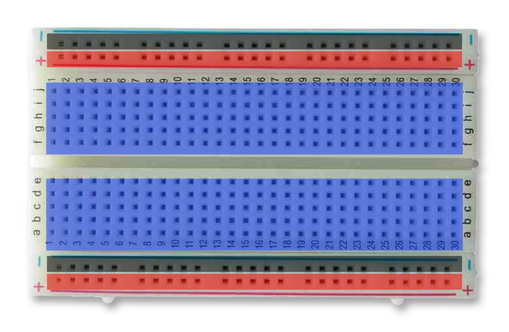

# Breadboard



## Alimenter les composants
```note
💡 Convention
noir = masse
rouge = alimentation (+5V, +12V, -5V... )
```

Habituellement, les trous d'une même **ligne** sont reliés sur cette zone. Ainsi, vous avez une ligne d'alimentation parcourant le long de la carte.

## Connecter les composants

Ensuite, on peut voir des zones en bleu. Ces zones sont reliées entre elles par **colonne**. 

Tous les trous sur une même colonne sont reliés entre eux. En revanche, chaque colonne est distincte. Ainsi, sur le dessin ci-dessus, on peut voir que chaque colonne possède 5 trous reliés entre eux. En faisant chevaucher des composants sur plusieurs colonnes, vous pouvez les connecter entre eux.

## Espace coupant la carte

Dernier point, vous pouvez remarquer un espace coupant la carte en deux de manière symétrique. Cet espace coupe aussi la liaison des colonnes.

Cet espace au milieu est normalisé et fait la largeur des circuits intégrés standards. En posant un circuit intégré à cheval au milieu, chaque patte de ce dernier, se retrouve donc sur une colonne, isolée de la précédente et de la suivante.

## Broches 0 et 1 ou RX et TX

Les broches de l'Arduino **0** et **1**, appelées aussi **RX** et **TX**, permettent de communiquer avec l'ordinateur. Il est recommandé de ne pas utiliser ces broches pour brancher vos LEDs, mais de privilégier les broches numérotées de 2 à 13 !

Pour le branchement des LED, la patte la plus longue doit être reliée côté "+", la plus courte côté "-". Sinon, elle ne s’allumera pas !

Vin (connecteur ou pin) peut être utilisé pour alimenter l'arduino (5V à 12V **max**)
